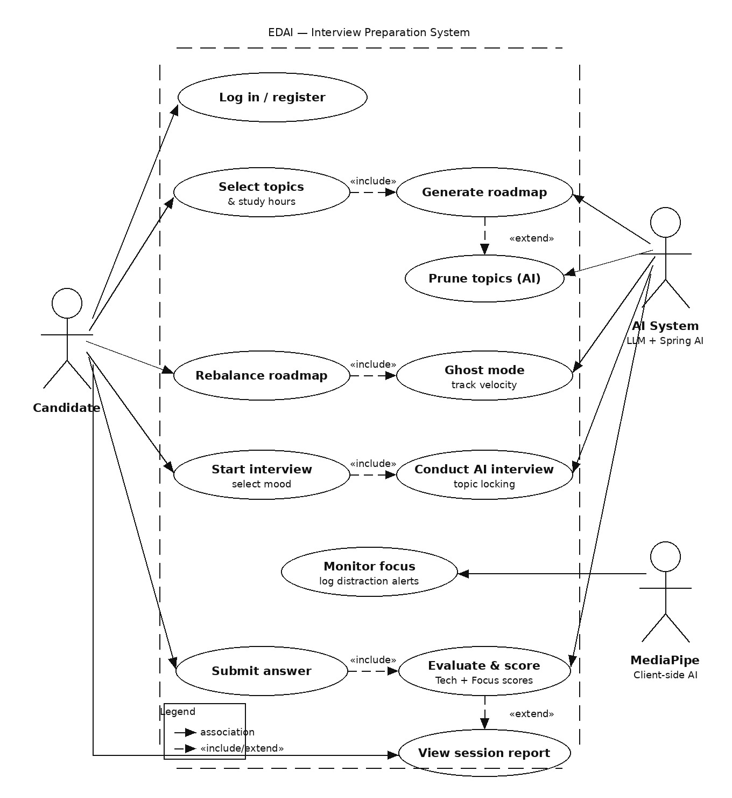

# Project Description
The project is a comprehensive Interview Preparation and Learning Roadmap tracking platform. It allows users to generate personalized daily learning plans targeting specific job profiles and companies. The system employs an innovative "Ghost Performance" metric—similar to racing against a ghost in video games—to help users sync their pacing against calculated benchmarks. Additionally, it offers automated mock interviews using varying AI Personas (Strict, Medium, Friendly). The application evaluates not just technical scoring, but also focus scoring via focus alerts, creating a well-rounded analytics profile for the user.

## Completed / In Progress

**Backend (Completed / Advanced Progress):**
- **Core Entities & Repositories Structure:** Implementation of all major models including `User`, `TargetProfile`, `Roadmap`, `RoadmapTopic`, `GhostPerformance`, `FocusAlert`, and various `InterviewerPersona` classes (Friendly, Medium, Strict).
- **Service Layer:** Crucial business logic services are implemented and active, notably `AuthService`, `GhostService`, `InterviewSimulationService`, `FocusAnalyticsService`, and `RoadmapService`.
- **API Endpoints:** Functional Spring Boot REST controllers for Ghost synchronization, Roadmaps, Transcriptions, and Focus management.
- **Authentication:** JWT-based user security structure.

**Frontend (In Progress):**
- **Foundation & Routing:** React application initialized with basic routing layout constraints (`AppRouter`, `PrivateRoute`).
- **Authentication Views:** Functioning UI for `LoginPage` and `RegisterPage`.
- **Dashboard Interfaces:** Components for setting up and rendering Roadmaps (`RoadmapSetup`, `RoadmapUI`, `UserRoadmaps`) and Mock Interviews (`InterviewSetup`, `InterviewUI`).

## Not Implemented / Planned Features

- **Comprehensive Testing:** Lack of extensive unit tests, integration tests, and end-to-end (E2E) testing for both backend APIs and frontend UI components.
- **Advanced Ghost Performance UI:** Detailed visual graphs and real-time interactive tracking elements for the Ghost sync on the frontend are pending.
- **Hardware Integration for Focus Alerts:** Actual complex user physical tracking (like webcam focus or attention drift integration via computer vision) remains fully integrated on the client-side as backend currently acts as a data sink.
- **Extensive CI/CD Pipeline:** DevOps pipelines for automated linting, testing, and active platform deployment are not fully implemented.

---

## Appendix: Core Project UML Diagram
UML diagram
@startuml

skinparam classAttributeIconSize 0
skinparam linetype ortho
hide empty methods

enum Role {
  USER
  ADMIN
}

class User {
  - name: String
  - email: String {unique}
  - password: String
  - role: Role
  - experienceLevel: String
  + getAuthorities(): Collection
  + isAccountNonExpired(): boolean
}

class TargetProfile {
  - roleName: String
  - companyName: String
  - targetDate: LocalDate
  - dailyHourLimit: Double
  - maxDailyThreshold: Double
}

class Roadmap {
  - createdAt: LocalDateTime {readOnly}
  - startDate: LocalDate
  - endDate: LocalDate
  + calculateRequiredVelocity(): Double
  + rebalanceRoadmap(): void
}

class RoadmapTopic {
  - title: String {unique}
  - priority: String
  - estimatedHours: Double
  - isCompleted: Boolean
  - sequenceOrder: Integer {ordered}
  + markAsComplete(): void
}

class Subtopic <<Value Object>> {
  - title: String {unique}
  - isCompleted: Boolean
}

class GhostPerformance {
  - lastSyncedTopicIndex: Integer
  - initialFixedVelocity: Double
  + syncPosition(userPace: Double): void
}

abstract class InterviewerPersona {
  - baseMood: String
  - followUpDepth: Integer
  + generatePrompt(context: String): String
}

class StrictPersona
class MediumPersona
class FriendlyPersona

class InterviewSession {
  - startTime: LocalDateTime
  - endTime: LocalDateTime
  - techScore: Double {0 <= value <= 100}
  - focusScore: Double {0 <= value <= 100}
  + calculateOverallScore(): Double
  + concludeSession(): void
}

class InterviewLog {
  - role: String
  - content: String
  - timestamp: LocalDateTime
}

class FocusAlert {
  - alertType: String
  - timestamp: LocalDateTime
}

' Relationships
User --> Role : has

User "1" o-- "0..*" TargetProfile : manages
User "1" --> "0..*" InterviewSession : attempts

TargetProfile "1" *-- "1" Roadmap : generates

Roadmap "1" -- "1.." RoadmapTopic : contains
Roadmap "1" *-- "1" GhostPerformance : benchmark

RoadmapTopic "1" -- "0.." Subtopic : includes

InterviewSession "1" --> "1" TargetProfile : tests
InterviewSession "1" --> "1" InterviewerPersona : uses
InterviewSession "1" -- "0.." InterviewLog : logs
InterviewSession "1" -- "0.." FocusAlert : alerts

InterviewerPersona <|-- StrictPersona
InterviewerPersona <|-- MediumPersona
InterviewerPersona <|-- FriendlyPersona

' Constraints

note right of InterviewerPersona
  {disjoint, complete}
end note

note right of RoadmapTopic
  {ordered by sequenceOrder}
end note

note right of User
  {max 5 InterviewSessions per day}
end note

note right of InterviewSession
  {endTime > startTime}
end note

@enduml

## Appendix: Core Project Use Case Diagram

